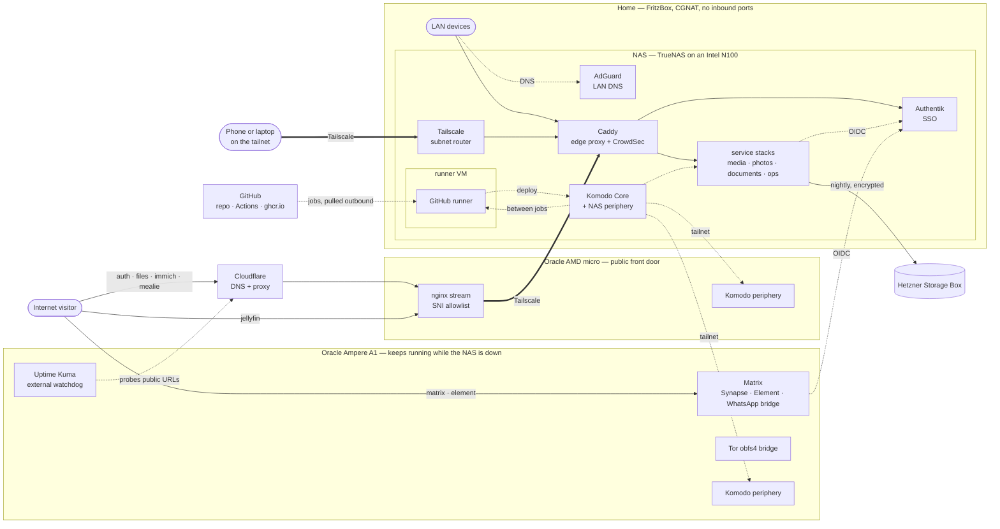
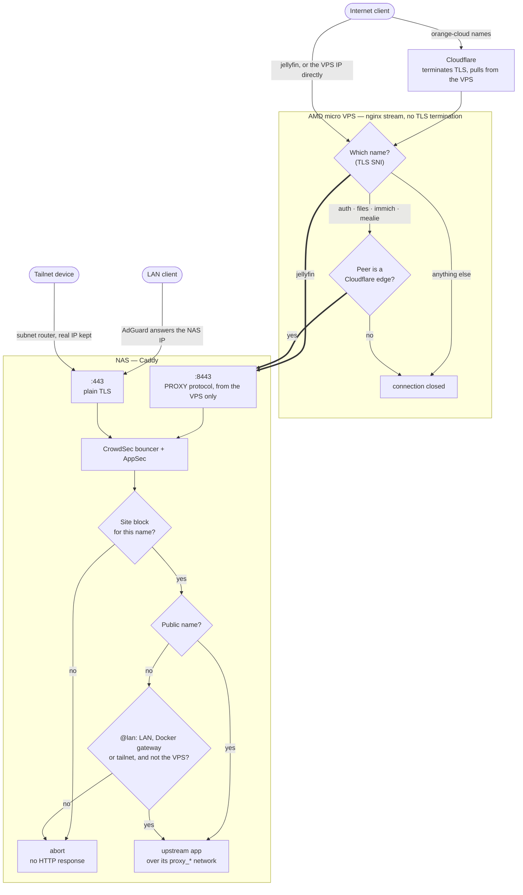
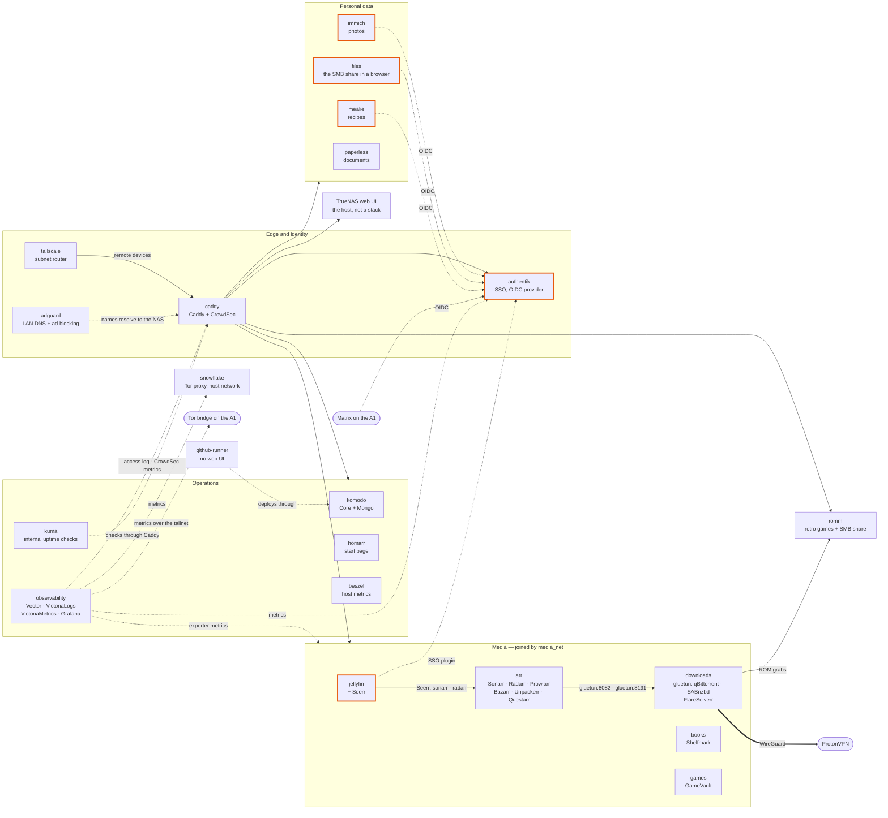
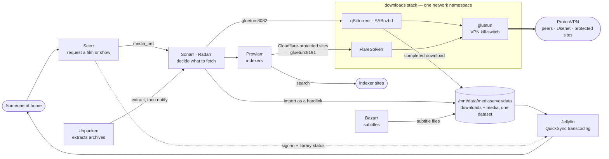
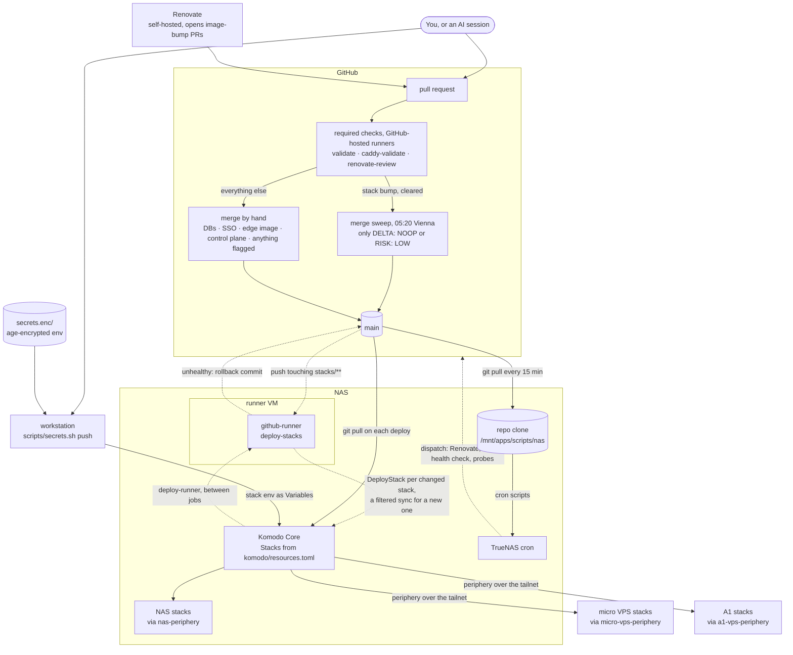
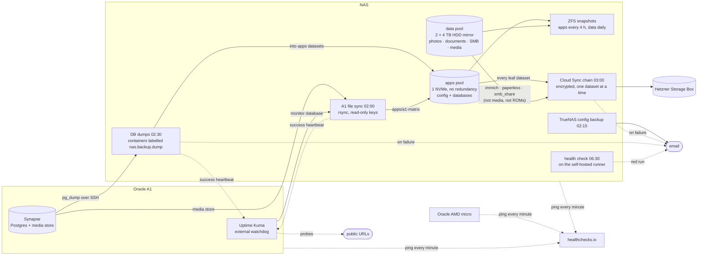

# Architecture

How the NAS, the two Oracle hosts and the outside services fit together, drawn as diagrams. They
are a map, not the reference: exact ports, addresses, schedules and policy live in the docs linked
under each diagram, and those win if the two ever disagree.

GitHub renders the diagrams (Mermaid). Locally, any Markdown preview with Mermaid support does.

**Reading them:** a solid arrow is traffic or data, a dotted arrow is authentication, monitoring or a
control signal, and a thick arrow is a tunnel (Tailscale, or the ProtonVPN WireGuard).

1. [The big picture](#1-the-big-picture) — the three hosts and the outside services
2. [The edge](#2-the-edge) — who reaches which hostname
3. [Inside the NAS](#3-inside-the-nas) — stacks, shared networks, SSO
4. [The media pipeline](#4-the-media-pipeline) — from a request to a playable file
5. [From commit to running container](#5-from-commit-to-running-container)
6. [Backups and watchdogs](#6-backups-and-watchdogs)

## 1. The big picture

The NAS sits at home behind CGNAT and accepts no inbound connection from the internet. Two Oracle
Cloud hosts share its tailnet: the AMD micro holds the public IP the NAS's web traffic arrives on,
and the Ampere A1 runs what has to keep working while the NAS is down.

- **Public web traffic never touches the home router.** It lands on the micro VPS, which forwards
  raw TCP to Caddy on the NAS over Tailscale — [micro-vps-ingress](services/micro-vps-ingress.md).
- **LAN and tailnet clients skip the VPS entirely.** AdGuard resolves `*.example.com` to the NAS,
  so they talk to Caddy directly — [network.md](network.md#dns--reverse-proxy).
- **Matrix is the one public service not behind Caddy on the NAS.** Its names point straight at the
  A1, so chat keeps working through a NAS reboot; only a new SSO login needs Authentik at home —
  [a1-vps-matrix](services/a1-vps-matrix.md).
- **Komodo Core on the NAS is the single control plane.** It deploys through a periphery agent on
  each host, reached on the LAN for the NAS and its runner VM and only on the tailnet for the VPSes —
  [komodo](services/komodo.md). Portainer held this role until 2026-09-17.
- **The GitHub runner runs in a VM on the NAS**, not on the host it deploys to. No job deploys it:
  Komodo recreates it between jobs — [github-runner](services/github-runner.md).

## 2. The edge

Two independent layers decide who reaches which hostname: the SNI allowlist on the VPS, and a
client-IP matcher in the Caddyfile. The probe checks each layer on its own, because a failure in one
is masked by the other.

- **Five names are public** — `auth`, `files`, `immich`, `jellyfin`, `mealie` — and every other name
  is LAN-only. The authoritative list is
  [network.md → Access control](network.md#access-control-who-can-reach-each-subdomain), asserted
  every 6 h by [`edge-access-policy.yml`](../.github/workflows/edge-access-policy.yml).
- **Why `:8443`:** the VPS prepends a PROXY-protocol header so Caddy sees the real client address,
  and only the `:8443` listener accepts one, only from the VPS. LAN clients use plain `:443`, where a
  forged header just fails the TLS handshake —
  [caddy](services/caddy.md#the-8443-proxy-protocol-listener).
- **The VPS's own tailnet address is excluded from `@lan`.** It sits inside the tailnet range the
  matcher otherwise allows, so without that exclusion every forwarded public request would count as
  a LAN client.
- **Behind the public names:** `auth` goes to the Authentik outpost; `files`, `immich` and `mealie`
  go straight to the app, which runs its own OIDC login against Authentik; `immich` and `jellyfin`
  additionally answer `403` on their password endpoints at the public edge, so internet logins go
  through SSO — [jellyfin-authentik-sso](runbooks/setup-operations/jellyfin-authentik-sso.md).
  **No public name is behind an Authentik forward-auth proxy**, and none can be: it breaks the
  mobile/native clients and the anonymous share links. Who may log in is enforced by the
  `nas-users` application binding instead —
  [authentik.md → Application access](services/authentik.md#application-access-the-login-allowlist).
- **CrowdSec bans the visitor, not Cloudflare.** For the orange-cloud names Caddy takes the client
  IP from `CF-Connecting-IP`; access control deliberately ignores that header —
  [caddy](services/caddy.md#real-client-ip-behind-cloudflare).

## 3. Inside the NAS

Hub and spoke: `stacks/caddy` defines one `proxy_<stack>` network per web-facing stack, and every
other stack joins only its own, so a compromised app can reach Caddy but not its neighbours. An
orange outline marks a stack with a public name (Seerr, inside `jellyfin`, stays LAN-only).

- **`media_net` is the one deliberate cross-stack network.** The *arr apps keep hostnames like
  `gluetun:8082` and `sonarr:8989` in their own config databases, so the stacks split out of the
  old `mediaserver` still have to resolve each other. `books` and `games` join it for consistency;
  nothing depends on that — [network.md → Docker networks](network.md#docker-networks).
- **Authentik down means no SSO login** for `files`, `immich`, `mealie`, public Jellyfin and Matrix,
  and `files` cannot even start, because its OIDC discovery is fatal at boot —
  [authentik](services/authentik.md).
- **VictoriaMetrics joins a scraped stack's `proxy_*` network, never its internal one**, so the
  metrics store never shares a network with a database — [observability](services/observability.md).
- `snowflake` and the Beszel agent run on the host network, outside the `proxy_*` model.

## 4. The media pipeline

- **Downloads and the library share one dataset**, so an import is a hardlink, not a copy —
  [arr](services/arr.md#notes).
- **The download clients have no network of their own.** They live in gluetun's network namespace:
  if the tunnel drops their traffic stops, and they do not start until gluetun is healthy —
  [downloads](services/downloads.md).
- **ROMs take a side path.** qBittorrent also mounts RomM's library, which RomM plays in the browser
  and shares over SMB as `roms`. Books (Shelfmark) and games (GameVault) read their own folders
  under `media/`.
- **None of the media is backed up** — it is re-acquirable. The apps' configuration, under
  `apps/mediaserver/config`, is — [storage.md](storage.md#local-zfs-snapshots).

## 5. From commit to running container

Every stack runs from `main`, and nothing is edited on a host by hand: a merge is the deploy.

- **Renovate raises every image bump; nothing merges one blind.** Each stack PR gets an image-delta
  check and a Claude risk verdict (`renovate-review`), and the morning sweep merges only a no-op or
  `RISK: LOW`. Databases, SSO, the edge image and the Komodo control plane are always merged by hand —
  [scheduled-tasks.md → Renovate](scheduled-tasks.md#renovate--dependency-update-prs-github-not-host).
- **`deploy-stacks` deploys only the stacks whose folder changed**, through Komodo. It creates a new
  owned stack first, checks the containers, and rolls a stack back if it comes up unhealthy. It never
  tears one down — [deploy-stacks](runbooks/setup-operations/deploy-stacks.md). Komodo's hourly
  `reconcile-owned` Procedure deploys anything a lost run left behind.
- **`komodo/resources.toml` picks the host**, one `server` per Stack.
- **Some folders sit outside this path**, applied by hand:
  - The four peripheries, because a control plane cannot redeploy the transport it deploys through.
  - `komodo`, which deploys only when someone presses Deploy.
  - `github-runner`, which Komodo's `deploy-runner` Procedure deploys between jobs, because no job
    may recreate the runner it runs on.
- **Config that is not compose reaches the host by `git pull`.**
  - Container config comes from Komodo's clone, which each deploy pulls: the Caddyfile, the
    Authentik blueprints, the observability config and `files`' `config.yaml`. The `caddy` Stack's
    `post_deploy` reloads Caddy ([caddy.md](services/caddy.md)).
  - The cron scripts alone come from the NAS clone at `/mnt/apps/scripts/nas`, which fast-forwards
    every 15 minutes ([nas-repo-autopull](runbooks/setup-operations/nas-repo-autopull.md)).
- **Secrets never pass through CI.** Per-stack env lives age-encrypted in `secrets.enc/` and reaches
  Komodo's Variables from a workstation — [secret-sync](runbooks/setup-operations/secret-sync.md).
- **Pull-request jobs run on GitHub-hosted runners only.** The self-hosted runner in the NAS's VM takes
  just the jobs that need the LAN — deploys, the health check, the deploy-state probe — so a pull
  request never executes on the host.

## 6. Backups and watchdogs

- **Two layers of backup:** local ZFS snapshots for a quick restore, and a nightly encrypted push to
  a Hetzner Storage Box for losing the machine. The `apps` pool is a single NVMe with no redundancy,
  which is why all of it is both snapshotted every 4 hours and synced offsite —
  [storage.md](storage.md), [backup](runbooks/backup-restore/backup.md).
- **Databases are dumped, not just snapshotted.** Every container labelled `nas.backup.dump=true` is
  discovered and dumped, on the NAS and on the A1, into a dataset the chain then carries offsite —
  [postgres-dump](runbooks/backup-restore/postgres-dump.md).
- **The nightly order is deliberate:** snapshots 01:00, A1 file sync 02:00, config email 02:15,
  dumps 02:30, cloud sync 03:00 — [scheduled-tasks.md](scheduled-tasks.md).
- **Something outside the house notices when everything inside it is down.** Each host pings
  healthchecks.io every minute, the A1's Uptime Kuma probes the public URLs and receives the backup
  jobs' heartbeats, and a failed backup or health check sends an email —
  [external-heartbeat](runbooks/setup-operations/external-heartbeat.md).

## Keeping this current

Update the matching diagram in the same change when you add or remove a stack, change how traffic
reaches a service, or change the deploy or backup path. The diagrams name stacks and hosts, never
image versions, and carry only the ports and addresses that identify a path — so a Renovate bump
never touches this file.
